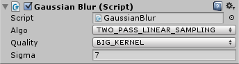
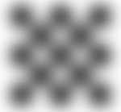

# Blur for Unity3D

## Gaussian Blur
Based on [this blog post](https://software.intel.com/en-us/blogs/2014/07/15/an-investigation-of-fast-real-time-gpu-based-image-blur-algorithms).

### Usage

Chose algorithm :
* Naïve
* Two pass
* Two pass with linear sampling

and filter size :
* LITTLE_KERNEL (7)
* MEDIUM_KERNEL (35)
* BIG_KERNEL (127)

### Graph

|LITTLE_KERNEL 3 sigma|MEDIUM_KERNEL 10 sigma|BIG_KERNEL 25 sigma|
|:-:|:-:|:-:|
||||

### More
#### Kawase blur
At this moment kawase blur have not param
5 pass with [0, 1, 2, 2, 3] offset
...